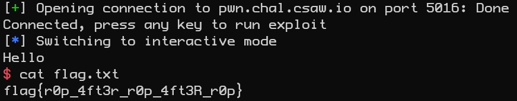

# Roppity - 50 points
This challenge involved a very generic buffer overflow + ROP/return2libc exploit. I say generic because thankfully I was actually able to use a write-up to learn the technique myself and my code was able to mirror the example very well.

I will try to summarize but please be sure to check out the write-up on this type of problem that I used from "[tasteofsecurity.com](https://tasteofsecurity.com/security/ret2libc-unknown-libc/)". 

## Pre-reqs
If you are unfamiliar with exploitation, I recommend a few steps prior to attempting this type of challenge.
1. Perform a basic buffer overflow where you can gain control of EIP and direct execution to generated shellcode
2. Basic ROP understanding of what you can do with returns in the ROP chain. 
3. Have a basic knowledge of DEP as this is one reason you can't add your own shellcode like in step 1 above.

Following this understanding, Ret2libc will make more sense from the perspective that you will need to jump to certain addresses to call the functions you need.

## RET2LIBC basic explanation
The basic steps are something close to what I have below. This was explained to me a few days before encountering the challenge and I think if you have a mental model for what you are trying to do, it helps when you go to perform the task. If this doesn't make sense, there are plenty of resources online for ret2libc in addition to the one I linked above.  
1. We can't execute any shellcode due to NX being enabled on the binary and libc so we can't put shellcode in our payload.
2. We use rop to jump to a pop rdi. This pops the address of libc_main into RDI. 
3. Address of PUTs is pulled out with pwn tools and we can then return to puts. Puts will leak back the actual address of libc_main. We need to leak this because of ASLR? I believe, because it will be different on every system.
4. We use what we know about offsets in the libc-2.27.so provided with the challenge to calculate the true base address of libc.
5. Now that we have the true address of libc, we can find offets for where system is located in libc.
6. We call system and give it "/bin/sh" so it will execute a shell
7. We call interactive with pwntools and then cat the flag.txt

## Flag

``` 
flag{r0p_4ft3r_r0p_4ft3R_r0p}
```