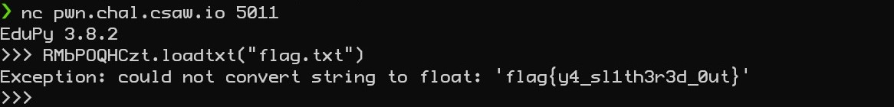

# Slithery - 100 points
This challenge puts you into a type of python jail. The only thing you are allowed to do is run a small set of commands like print, for example. With print, you can then print the values of the weird digits. 

For example
```
>>>print(ORppRjAVZL)
```
will show you the full array and tell you which libraries are loaded. The rest of the information was gathered from this method.

The final_cmd function runs some python code to open base64.b64decode and then decode the b64 values later in the string so that it can import numpy. Then it runs your command so long as it's not on the denylist. 

## Flag
The trick to getting the flag is to run the loadtxt on "RMbPOQHCzt" which really runs numpy.loadtxt. 

Attempting to load the flag will run print the flag.



```
flag{y4_sl1th3r3d_0ut}
```
