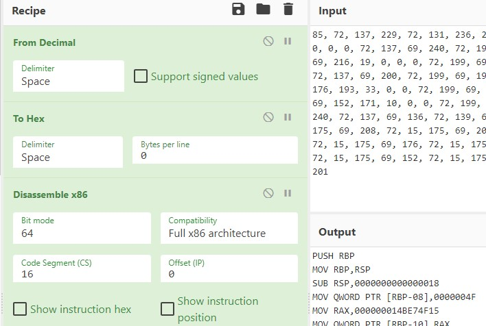
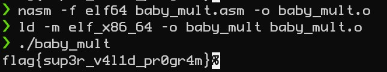

# baby_mult - 50 points
This program provides "program.txt" which contains the follow array of bytes:
```
85, 72, 137, 229, 72, 131, 236, 24, 72, 199, 69, 248, 79, 0, 0, 0, 72, 184, 21, 79, 231, 75, 1, 0, 0, 0, 72, 137, 69, 240, 72, 199, 69, 232, 4, 0, 0, 0, 72, 199, 69, 224, 3, 0, 0, 0, 72, 199, 69, 216, 19, 0, 0, 0, 72, 199, 69, 208, 21, 1, 0, 0, 72, 184, 97, 91, 100, 75, 207, 119, 0, 0, 72, 137, 69, 200, 72, 199, 69, 192, 2, 0, 0, 0, 72, 199, 69, 184, 17, 0, 0, 0, 72, 199, 69, 176, 193, 33, 0, 0, 72, 199, 69, 168, 233, 101, 34, 24, 72, 199, 69, 160, 51, 8, 0, 0, 72, 199, 69, 152, 171, 10, 0, 0, 72, 199, 69, 144, 173, 170, 141, 0, 72, 139, 69, 248, 72, 15, 175, 69, 240, 72, 137, 69, 136, 72, 139, 69, 232, 72, 15, 175, 69, 224, 72, 15, 175, 69, 216, 72, 15, 175, 69, 208, 72, 15, 175, 69, 200, 72, 137, 69, 128, 72, 139, 69, 192, 72, 15, 175, 69, 184, 72, 15, 175, 69, 176, 72, 15, 175, 69, 168, 72, 137, 133, 120, 255, 255, 255, 72, 139, 69, 160, 72, 15, 175, 69, 152, 72, 15, 175, 69, 144, 72, 137, 133, 112, 255, 255, 255, 184, 0, 0, 0, 0, 201
```

Initially I believed this to be decimal representation of bytes and that it needed to be written as bytes to a file to be executed. This did not work on its own as it didn't create a complete executable program. However, after playing around with the values for a bit, it was discovered that it was indeed executable instructions. Tools like [Cyber Chef](https://gchq.github.io/CyberChef/) can be used to perform these steps and get you a majority of the way through the challenge.

## Cyber Chef
Here's a clip of what this looks like with the recipe that was used.


You can also visit this [link](https://gchq.github.io/CyberChef/#recipe=From_Decimal('Space',false)To_Hex('Space',0)Disassemble_x86('64','Full%20x86%20architecture',16,0,false,false)&input=ODUsIDcyLCAxMzcsIDIyOSwgNzIsIDEzMSwgMjM2LCAyNCwgNzIsIDE5OSwgNjksIDI0OCwgNzksIDAsIDAsIDAsIDcyLCAxODQsIDIxLCA3OSwgMjMxLCA3NSwgMSwgMCwgMCwgMCwgNzIsIDEzNywgNjksIDI0MCwgNzIsIDE5OSwgNjksIDIzMiwgNCwgMCwgMCwgMCwgNzIsIDE5OSwgNjksIDIyNCwgMywgMCwgMCwgMCwgNzIsIDE5OSwgNjksIDIxNiwgMTksIDAsIDAsIDAsIDcyLCAxOTksIDY5LCAyMDgsIDIxLCAxLCAwLCAwLCA3MiwgMTg0LCA5NywgOTEsIDEwMCwgNzUsIDIwNywgMTE5LCAwLCAwLCA3MiwgMTM3LCA2OSwgMjAwLCA3MiwgMTk5LCA2OSwgMTkyLCAyLCAwLCAwLCAwLCA3MiwgMTk5LCA2OSwgMTg0LCAxNywgMCwgMCwgMCwgNzIsIDE5OSwgNjksIDE3NiwgMTkzLCAzMywgMCwgMCwgNzIsIDE5OSwgNjksIDE2OCwgMjMzLCAxMDEsIDM0LCAyNCwgNzIsIDE5OSwgNjksIDE2MCwgNTEsIDgsIDAsIDAsIDcyLCAxOTksIDY5LCAxNTIsIDE3MSwgMTAsIDAsIDAsIDcyLCAxOTksIDY5LCAxNDQsIDE3MywgMTcwLCAxNDEsIDAsIDcyLCAxMzksIDY5LCAyNDgsIDcyLCAxNSwgMTc1LCA2OSwgMjQwLCA3MiwgMTM3LCA2OSwgMTM2LCA3MiwgMTM5LCA2OSwgMjMyLCA3MiwgMTUsIDE3NSwgNjksIDIyNCwgNzIsIDE1LCAxNzUsIDY5LCAyMTYsIDcyLCAxNSwgMTc1LCA2OSwgMjA4LCA3MiwgMTUsIDE3NSwgNjksIDIwMCwgNzIsIDEzNywgNjksIDEyOCwgNzIsIDEzOSwgNjksIDE5MiwgNzIsIDE1LCAxNzUsIDY5LCAxODQsIDcyLCAxNSwgMTc1LCA2OSwgMTc2LCA3MiwgMTUsIDE3NSwgNjksIDE2OCwgNzIsIDEzNywgMTMzLCAxMjAsIDI1NSwgMjU1LCAyNTUsIDcyLCAxMzksIDY5LCAxNjAsIDcyLCAxNSwgMTc1LCA2OSwgMTUyLCA3MiwgMTUsIDE3NSwgNjksIDE0NCwgNzIsIDEzNywgMTMzLCAxMTIsIDI1NSwgMjU1LCAyNTUsIDE4NCwgMCwgMCwgMCwgMCwgMjAx) to see the recipe in action with input.

From here, it is hacker's choice if you want to rewrite the instructions in python or make the program executable with nasm. I chose to make the program executable. This involvs remove PTR from the disassembly as well as updating all numerical values with 0x to let the compiler know they are hex. 

If you are interested in the final assembly, you can see the results of this in baby_mult.asm as I did change one or two values to the file based on a template for assembly. I also added a function so that it could print out the flag without needing to read it from memory.


## Nasm Compile Instructions
```
nasm -f elf64 baby_mult.asm -o baby_mult.o
ld -m elf_x86_64 -o baby_mult baby_mult.o
```


## Flag


```
flag{sup3r_v4l1d_pr0gr4m}
```