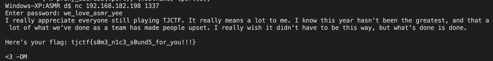

# ASMR - 60 points


```
nasm -f elf64 -F dwarf -g a23d4d8c9732230ec7b74eb15fceb2506991d1146a848f00ec41843f1aaafbd3_asmr.asm -o asmr.o

nasm -f elf64 asmr -o asmr.o
ld -m elf_x86_64 -o asmr asmr.o
```


# Solve

Well I may make a video about this to explain the steps more in depth. If you look at test2.py, you may be able to see what was required.

There were important steps and things to understand if you wanted to get the answer printed out to you. I enjoyed doing it this way because I learned more about syscalls with linux that I didn't know before. I'm a little disappointed I wasn't able to rewrite the flag by decoding in python before finding the password but sometimes it is more helpful to learn things when you step through with a debugger anyways. With a debugger you can see what is actually happening at each instruction. If they didn't give you a program that compiled, you would have to do it manually, which is still a great way to solve it.

## Background Required
If you wanted the flag printed out to you, you had to figure out that this was a socket program that was binding to port 1337. A bit of understanding of linux and syscalls may have been necessary and I will try to explain what I learned in a video. The alternative way was simply to decrypt the flag on your own.

## Flag
To get the flag you simply needed the write password to the socket after making aa connection. The password was stored in memory at the beginning of label two. If you broke down the assembly a bit, you may be able to determine the password decryption. To do this you take the two lines in memory at label 2, reverse them due to little endian (I think?), xor them with 0x69 and the output would be the password. This can be seen in test2.py. The rest of the program will then decrypt the long data string for you. As mentioned, this was mostly solved due to stepping through the program manually in a debugger.



