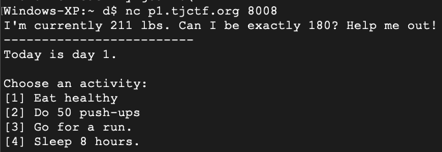
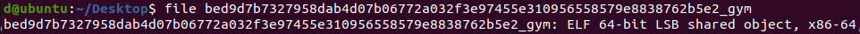
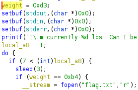
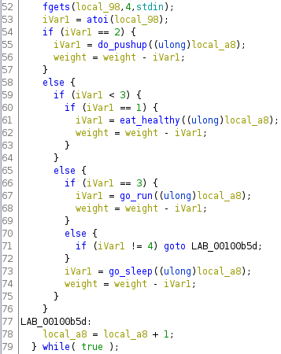
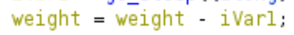
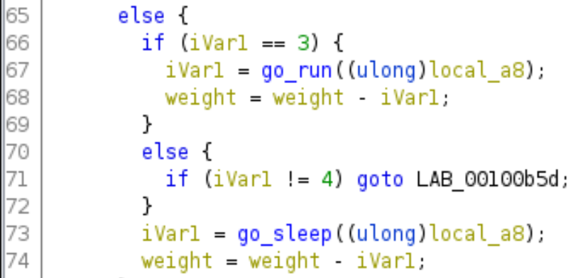
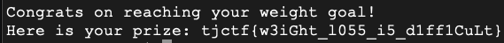

# Gym - 20 Points
Aneesh wants to acquire a summer bod for beach week, but time is running out. Can you help him create a plan to attain his goal?

nc p1.tjctf.org 8008

# Solve
The goal of this challenge is to achieve a weight 180. We are currently at 211 and we have the option to perform various exercises to reach this goal.

The options for activity is as follows:

## Background
We are provided with a generic file which can be assumed to be some type of binary. Running file against it confirms it is a 64 elf file.

As much as I would love to sift through this with gdb, I felt it was definitely necessary to break out Ghidra. Using Ghidra was a first for me and getting it set up was WAY quick.

## Ghidra
There are tons of guides explaining how to set up Ghidra. It's super easy and after opening it, it's pretty intuitive. There isn't a debugger at the point of writing this but there is the decompiler which helped a ton for this challenge. I will probably use it from this point forward, it just makes sense. 

A note on using the decompiler. I felt it was cheating to be frank. However, as someone who wants to learn reverse engineering and still wants a quick feedback loop, I feel this will help me go back and forth between and learn assembly better as a result.

Back to the challenge. With the decompiler, we can see where the current weight is set as well as where the check for the desired weight is. We already know know these values from the initial connection but you can see them set in hex (0xd3=211, 0xb4=180). (I renamed the variables in Ghidra)

Lastly, there are a few checks based on the result of the activity you picked. Different activities returned different variables which amounts the lbs lost. Each activity is a call to a function and to spare the images, each function simply return the integer value. Note, they were different from the activity number.

Instead of showing the function returns, here are what they actually mapped to.

[1] Eat healthy -> return 4; 
[2] Do 50 push-us -> return 1; 
[3] Go for a run. -> return 2; 
[4] Sleep 8 hours. -> return 3; 

Before I explain the way to solve it, I want to note that I was thinking it had something to do with the atoi as this function can lead to vulnerabilities. This didn't actually lead anywhere and the actually solution was more simple.

## Final Steps
We only have 7 days to lose the weight. It would be nice to call eat_healthy() 8 days in a row and reach the lose of 31 required. However, we can only make it to 28 without failing to meet our goal. That said, there is one way to achieve 31.

We need weight to be 180 and the location where this is modified appears as such. 

There is a step where this is called twice.

If we go for a run, we hit the modify code twice. Once in the first if statement, and the other after both if,else statements. This creates a value of 5 each time we go for a run.

## Flag
From here, we can use any combination of 5,4,3,2,1 to equal 31, losing the needed lbs.

I chose 5,5,5,5,5,3,3 or [3],[3],[3],[3],[3],[4],[4]

